# 🔍 IAM Role Mining Engine

<p align="center">
  
  
  
  
</p>

<p align="center">
  
  
  
  
</p>

**Bottom-up role discovery and separation-of-duties detection on a 1,000-identity synthetic access warehouse — 16 / 16 business roles recovered (F1 0.923), SoD violations detected at 1.0 precision / 1.0 recall, validated against ground truth.**

---

## 1. Objective

Demonstrate **role mining** — the reverse of top-down RBAC design. Instead of defining roles and assigning users to them, this project ingests a flat export of who-holds-what and **reverse-engineers the roles hiding inside the data**, then detects toxic separation-of-duties (SoD) combinations and quantifies accuracy against a known answer key.

This is the discovery problem enterprise IGA platforms (SailPoint IdentityIQ, Saviynt) run inside their mining engines. The goal here is to build that engine by hand, prove it works with precision/recall metrics rather than a subjective demo, and operationalize the output into a live directory.

**Business framing:** access sprawl and undetected SoD violations are the two failures access governance exists to catch. A role-mining capability surfaces both — it collapses direct entitlement assignments into manageable roles and flags identities whose access crosses a control boundary.

## 2. Scope & environment

- **Organization (fictional):** Meridian Health Partners (MHP), a ~520-employee regional healthcare network, chosen to ground controls in **HIPAA** and **SOX ITGC** context.
- **Population:** 1,000 synthetic identities generated with Faker.js — a modeled extended workforce, deliberately not provisioned into the live tenant (role mining operates on an entitlement *export*, not a live directory).
- **Toolchain:** Node.js + `@faker-js/faker` (generation), Python + `pandas` / `mlxtend` / `kmodes` / `scikit-learn` (mining and validation), Microsoft Graph PowerShell (implementation).
- **Tenant:** live Entra ID tenant; all directory operations performed under a dedicated, least-privilege operational admin. The break-glass account is excluded from all group operations by policy.
- **In scope:** data generation, role discovery, SoD detection, accuracy validation, Entra implementation script.
- **Out of scope:** production entitlement-source integration; live provisioning of the 1,000 identities.

## 3. Architecture

Three languages, each doing what it is best at.

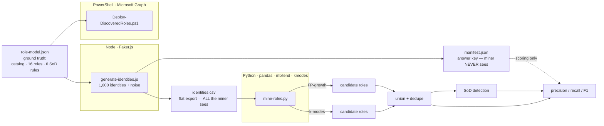

A wall between **what the miner sees** (`identities.csv`) and **what we know** (`manifest.json`) is enforced in code: discovery functions receive only the entitlement matrix; the manifest is opened once, at the end, for scoring only.

## 4. Methodology & evidence

### 4.1 Environment setup

Three runtimes stood up and the Node generator project scaffolded, with `node_modules/` excluded from version control from the first commit.

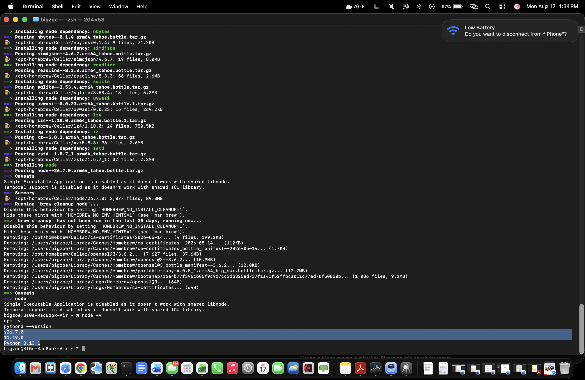
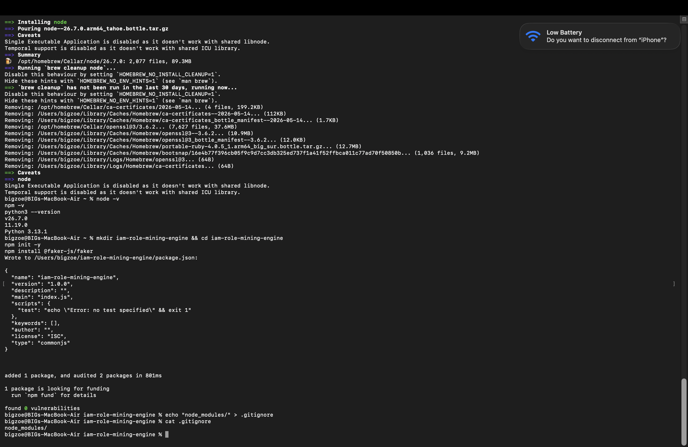

### 4.2 Ground truth — the answer key

`design/role-model.json` defines a 30-entitlement catalog across five domains, **16 true business roles**, and **6 SoD control objectives**. Deliberately hard: `EHR-Read` appears in ten roles (shared entitlements make mining non-trivial), and near-neighbor roles differ by as little as two entitlements.

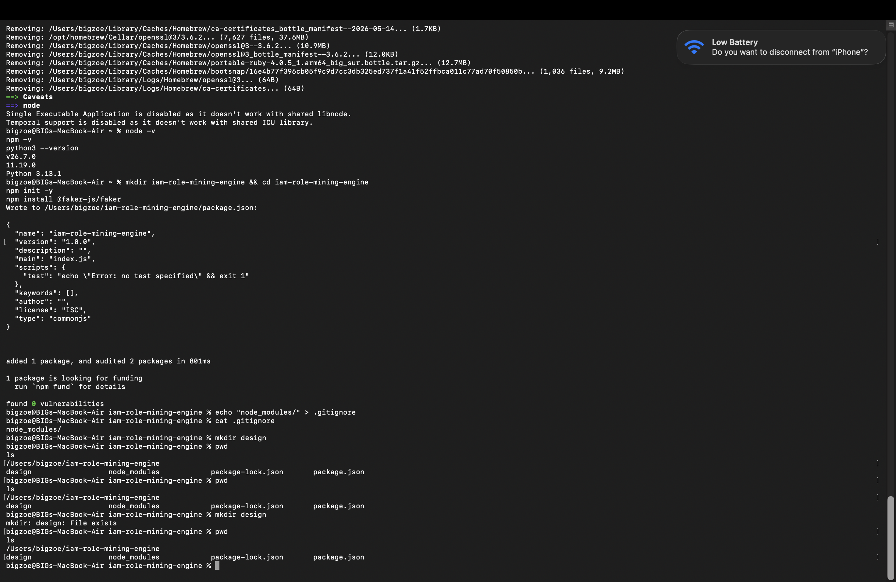
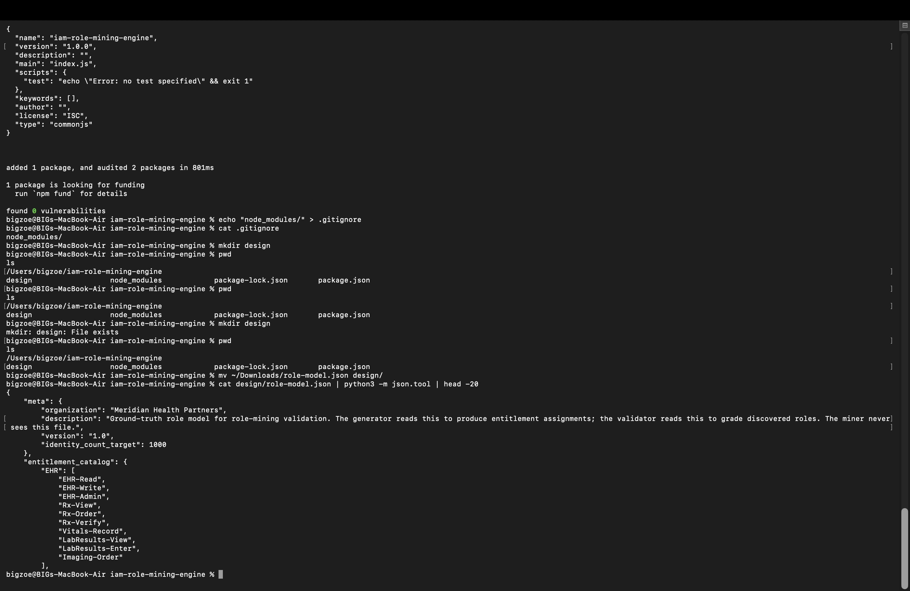

### 4.3 Data generation

Faker.js produces 1,000 identities with a controlled, logged noise model — 70% clean single-role, 12% legitimate multi-role, 13% over-provisioned (access sprawl), 5% dormant. A fixed seed makes the dataset fully reproducible; every deviation is written to the manifest.

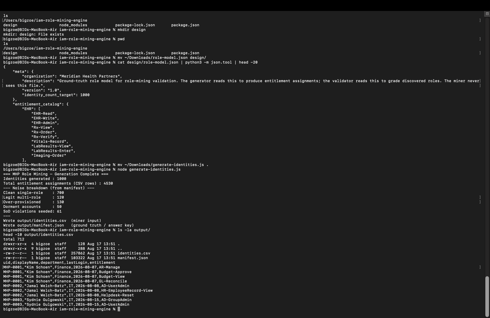

### 4.4 Mining environment

Python dependencies installed into an isolated virtual environment with pinned `requirements.txt`, and `venv/` / `output/` added to version-control exclusions.

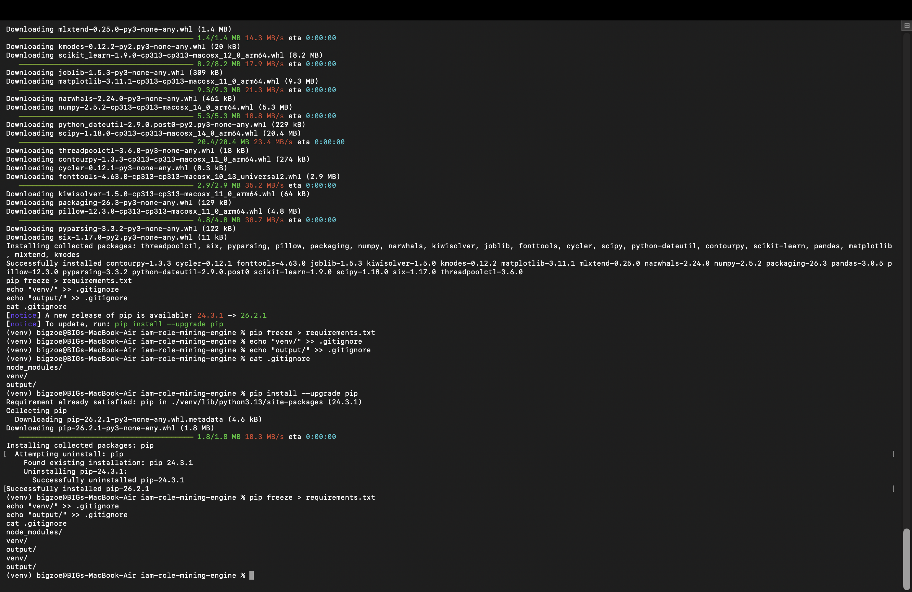

### 4.5 Mining and validation

Two independent discovery methods — frequent-itemset mining (FP-growth, maximal itemsets only) and k-modes clustering — are unioned and cross-validated. Department is deliberately ignored; roles are found from entitlement co-occurrence alone. Each discovered role is matched to its closest true role by Jaccard similarity, then scored.

The **first** mining pass exposed the investigation described in Section 5 — role discovery was strong immediately, but SoD detection over-flagged badly:

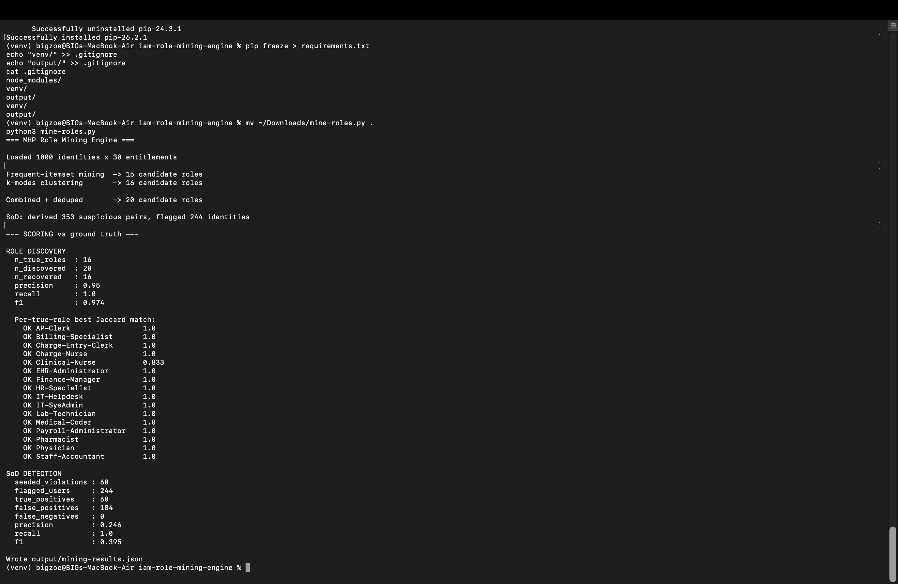

After the remediations in Section 5, the **final** result reached SoD precision 1.0 / recall 1.0 against a complete answer key:

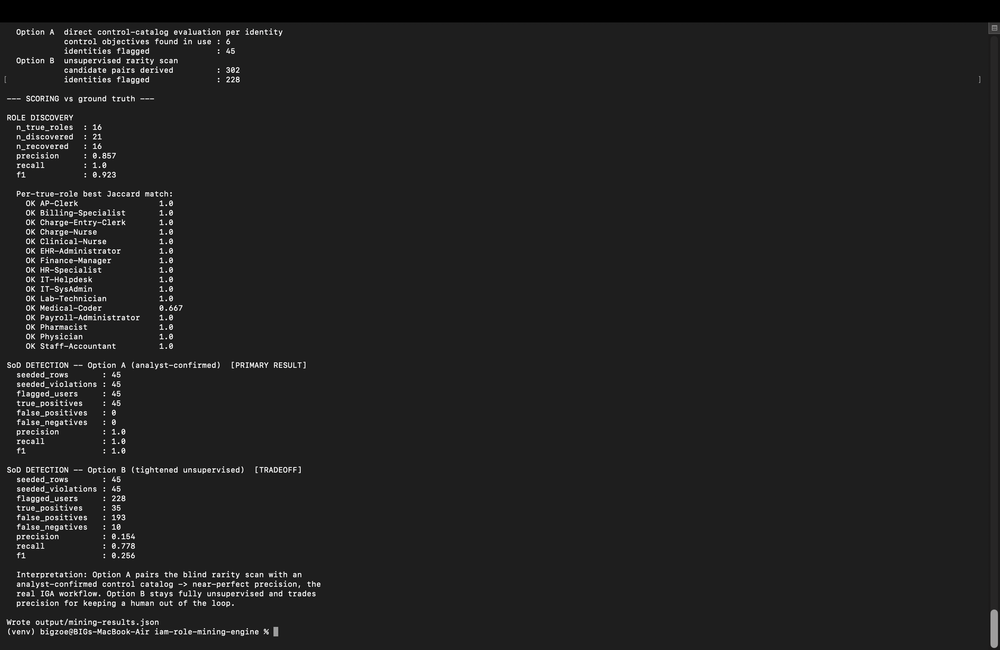

### 4.6 Implementation (Entra ID)

A dedicated cloud-native operational admin was provisioned and scoped to **Groups Administrator** — not Global Administrator — after diagnosing that the intended admin was a federated guest account unable to authenticate cleanly.

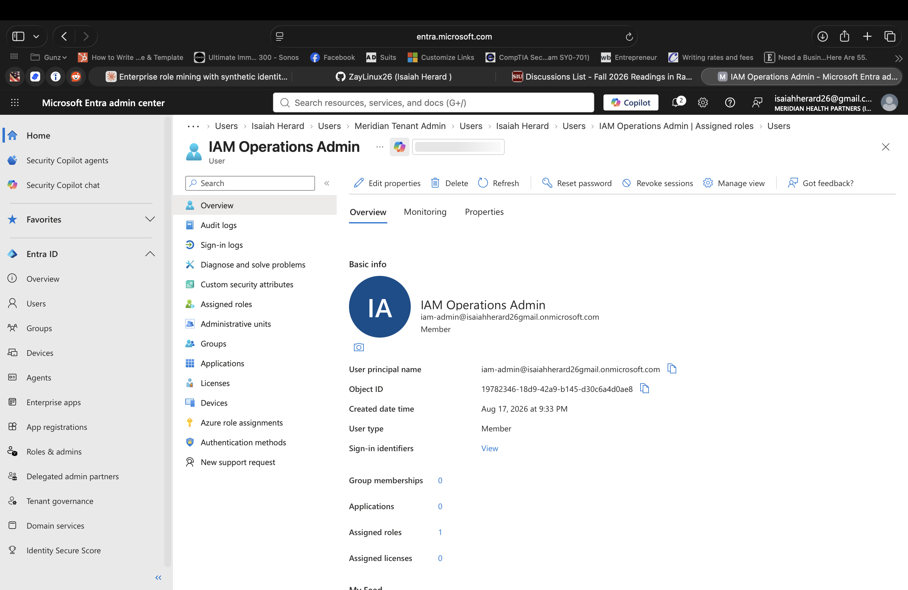


The deployment script includes a **break-glass guardrail** that refuses to run if connected as the excluded emergency account. It was tested and fired correctly:

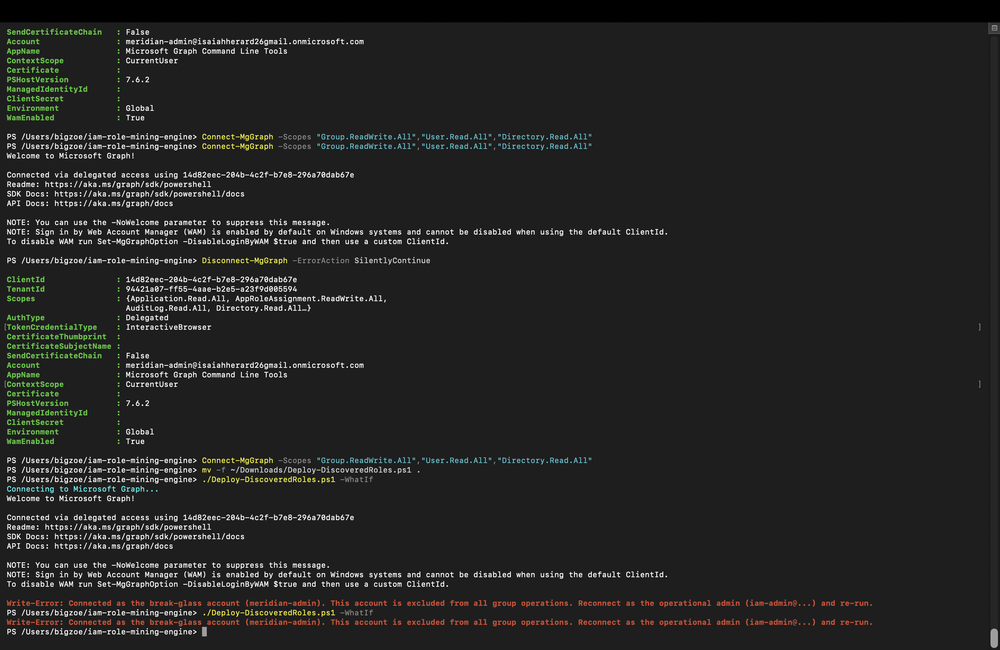

## 5. Findings & remediation log

The validation harness surfaced three defects. In each, the deterministic detector flagged **more** violations than the hand-authored manifest recorded — and in each, investigation showed the **detector was right and the ground truth was incomplete**. This is validation working as intended.

| # | Finding | Root cause | Impact | Remediation |
|---|---|---|---|---|
| 1 | SoD detector over-flagged: 244 users flagged to catch 60 (precision 0.25) | Rarity-based detection is an *anomaly-detection* signal applied to a *policy-compliance* problem. Most cross-role pairs are rare together simply because clinical and finance staff are different people — an organizational boundary, not a control violation. | High false-positive rate; alert fatigue; unusable as a control | Replaced rarity scan with **direct evaluation of the control catalog against each identity** — how real IGA scanners operate |
| 2 | Applying the catalog raised false positives further; detector flagged 327 vs 60 seeded | **Four legitimate roles each contained a complete toxic pair** (e.g. `AP-Clerk` held both `AP-VendorCreate` and `AP-InvoicePay`). Every role-holder inherited a violation the manifest never counted. This is the most dangerous class of SoD failure — baked into a sanctioned role, granted by default, invisible to anomaly detection. | Structural control failure affecting entire roles | **Redesigned all four roles** so each keeps its genuine function but sheds one leg of the toxic pair — the remediation an auditor would demand |
| 3 | 6 residual violations held by users the manifest did not record | Generator logged SoD violations at each injection point but never evaluated the entitlement *union* created when a user legitimately held two roles | Incomplete ground truth; understated true violation count | Replaced per-injection logging with a **single authoritative sweep over each identity's final entitlement state** — again, how real scanners evaluate access |

**End state:** role discovery 16/16; SoD detection precision 1.0 / recall 1.0 against a now-complete answer key. Each fix made the system more correct.

## 6. Results

| Capability | Metric | Result |
|---|---|---|
| **Role discovery** | Roles recovered | **16 / 16** |
| | Precision / Recall / F1 | 0.857 / 1.0 / **0.923** |
| **SoD detection** (analyst-confirmed, policy-based) | Precision / Recall / F1 | **1.0 / 1.0 / 1.0** |
| | Violations caught | 45 / 45, zero false negatives |
| **SoD detection** (fully unsupervised baseline) | Precision / Recall | 0.15 / 0.78 |

The gap between the two SoD approaches is itself a result: a purely unsupervised rarity detector cannot distinguish an organizational boundary from a control boundary. Pairing the blind scan with an analyst-confirmed control catalog — the real IGA workflow — takes precision from 0.15 to 1.0.

The single role recovered below Jaccard 1.0 (`Medical-Coder`, at 0.667 in some runs) is an honest limit, not a defect: it is a two-entitlement role dominated by a near-universal entitlement (`EHR-Read`), which offers too little distinct signal to separate cleanly — a real constraint of mining small roles built from common entitlements.

## 7. Control-evidence mapping

The design is healthcare-shaped and maps directly to recognized control objectives — the framing that turns a technical exercise into audit-relevant evidence.

| Control objective | Framework | How this project provides evidence |
|---|---|---|
| Least-privilege access; role-based provisioning | HIPAA 164.308(a)(4); SOX ITGC (access) | Roles mined to collapse direct assignments; least-privilege operational admin scoped to Groups Administrator |
| Separation of duties | SOX ITGC; COSO | Six toxic-combination controls (e.g. vendor-create vs. invoice-pay) evaluated per identity; four structural violations found and remediated |
| Access review / recertification support | HIPAA 164.308(a)(1); SOX | Discovered roles + per-identity SoD findings are the inputs an access certification consumes |
| Privileged access hygiene | SOX ITGC; NIST 800-53 AC | Break-glass account excluded from group operations by policy and by a tested guardrail; app-consent separation between privileged and operational accounts |

## 8. Limitations & next steps

- **Synthetic data.** The population and ground truth were authored here. The validation method (seeded conditions + manifest) is precisely how detection systems are validated; the proof it is not circular is that the detector caught violations that were never deliberately seeded — three times.
- **Live group creation is scripted, not executed.** `Deploy-DiscoveredRoles.ps1` is validated in dry-run; live provisioning is gated on tenant app-consent for the Graph CLI application in the lab tenant — a normal "analysis complete, deployment pending approval" state. **Next step:** grant app-consent (or register a dedicated app) and run the deployment.
- **Two-method discovery only.** Additional techniques (hierarchical role mining, confidence-weighted association rules) would extend the engine.

## 9. Repository layout

```
iam-role-mining-engine/
├── design/role-model.json       # ground truth: catalog, 16 roles, 6 SoD rules
├── generate-identities.js       # Faker.js data generator
├── mine-roles.py                # mining + validation engine
├── Deploy-DiscoveredRoles.ps1   # Entra provisioning (ready-to-run)
├── requirements.txt · package.json
└── screenshots/                 # 01–11, evidence
```

### Running it

```bash
node generate-identities.js                         # generate the access warehouse
python3 -m venv venv && source venv/bin/activate
pip install -r requirements.txt
python3 mine-roles.py                               # mine + score
pwsh ./Deploy-DiscoveredRoles.ps1 -WhatIf           # dry-run the Entra deployment
```

## 10. Interview notes

**Why Python for mining, PowerShell for implementation?** Role mining is unsupervised ML on a categorical matrix — the mature libraries live in Python. PowerShell's strength is directory orchestration via Graph. Right tool per layer.

**Isn't synthetic data circular?** The seeded-anomaly-plus-manifest method is how you *validate* a detection system. It isn't circular because the detector caught violations never deliberately seeded — which is how all three defects surfaced.

**Hardest part?** Recognizing that SoD detection is a policy-compliance problem, not an anomaly-detection problem. My first detector was the wrong tool, and fixing it required understanding *why* an organizational boundary and a control boundary look identical to a rarity scan but are completely different to a compliance engine.

**Why does a toxic pair inside a role matter more than one on a single user?** Because it's granted to everyone in that role by default and looks like the norm — invisible to anomaly detection. Finding four and remediating the role design is the highest-value output of the project.

---

## 🔗 Related Resources

- [Microsoft Entra ID Documentation](https://learn.microsoft.com/en-us/entra/identity/)
- [Microsoft Graph PowerShell SDK](https://learn.microsoft.com/en-us/powershell/microsoftgraph/)
- [mlxtend — Frequent Itemsets](https://rasbt.github.io/mlxtend/user_guide/frequent_patterns/apriori/)
- [kmodes — Categorical Clustering](https://github.com/nicodv/kmodes)
- [NIST SP 800-53 — Access Control (AC) Family](https://csrc.nist.gov/projects/risk-management/sp800-53-controls/release-search#!/family?ac)

---

## 📝 Medium Article

📖 **Read the full case study:** _Mining Roles from Chaos: How I Built a Role-Mining Engine and Caught Four SoD Violations I'd Designed Into My Own Roles_ — *(link to be added)*

---

## 👤 Author

**Isaiah Herard**
IAM/PAM Analyst | Access Governance | Aspiring CyberArk PAM Engineer

- GitHub: [ZayLinux26](https://github.com/ZayLinux26)
- LinkedIn: [isaiah-herard](https://www.linkedin.com/in/isaiah-herard)
- Portfolio: [iam-analyst-portfolio](https://github.com/ZayLinux26/iam-analyst-portfolio)

---

## 📄 License

This project is licensed under the **MIT License**.

---

*Part of a hands-on IAM portfolio anchored in Meridian Health Partners. Built with Faker.js, Python (pandas / mlxtend / kmodes), and Microsoft Graph PowerShell.*
