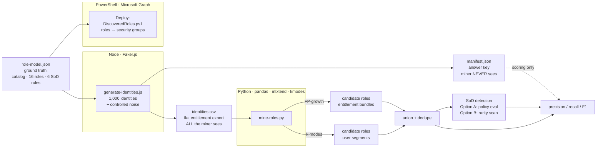

# IAM Role Mining Engine

**Bottom-up role discovery on a 1,000-identity synthetic access warehouse — recovered all 16 business roles (F1 0.923) and detected separation-of-duties violations at 1.0 precision / 1.0 recall, validated against ground truth.**

Built for **Meridian Health Partners (MHP)**, a fictional ~520-employee regional healthcare network used across this IAM portfolio to ground controls in HIPAA and SOX ITGC context.

Where a top-down RBAC project *designs* roles and maps jobs onto them, this project does the inverse and harder thing: it is handed a pile of messy entitlement assignments and **reverse-engineers the roles hiding inside them** — the same discovery problem SailPoint and Saviynt run inside their mining engines, done by hand, with metrics.

---

## Headline results

| Capability | Metric | Result |
|---|---|---|
| **Role discovery** | Roles recovered | **16 / 16** |
| | Precision / Recall / F1 | 0.857 / 1.0 / **0.923** |
| **SoD detection** (analyst-confirmed) | Precision / Recall / F1 | **1.0 / 1.0 / 1.0** |
| | Violations caught | 45 / 45, zero false negatives |
| **SoD detection** (fully unsupervised) | Precision / Recall | 0.15 / 0.78 — the honest baseline |

The gap between the two SoD approaches *is* a finding: a purely unsupervised rarity detector over-flags because it cannot tell an organizational boundary ("clinical staff and finance staff are different people") from a control boundary ("nobody should both create a vendor and pay it"). Pairing the blind scan with an analyst-confirmed control catalog — the real IGA workflow — is what takes precision from 0.15 to 1.0.

---

## What this demonstrates

- **Role mining** — frequent-itemset mining and clustering to discover roles from entitlement co-occurrence, the analytical core of enterprise IGA platforms
- **Separation-of-duties detection** — policy-based toxic-combination scanning mapped to SOX ITGC control objectives
- **Validation methodology** — a ground-truth manifest enabling precision/recall scoring rather than a subjective demo
- **Least-privilege operations** — scoped Graph permissions, a dedicated operational admin, and a break-glass exclusion control that was tested and fired

---

## Architecture

Three languages, each doing what it is best at: synthetic data generation, unsupervised discovery, and directory orchestration.



The wall between **what the miner sees** (`identities.csv`) and **what we know** (`manifest.json`) is enforced in code: discovery functions receive only the entitlement matrix; the manifest is opened once, at the very end, for scoring. Discovery never peeks at the answer.

---

## How it works

### 1 — Ground truth (`design/role-model.json`)
A 30-entitlement catalog across five domains (EHR, Billing, Finance, HR, Infrastructure), **16 true business roles**, and **6 SoD control objectives**. Deliberately hard: `EHR-Read` appears in ten roles (shared entitlements are what make mining non-trivial), and near-neighbor roles like `Clinical-Nurse` and `Charge-Nurse` differ by only two entitlements (naive clustering collapses them; a real miner keeps them distinct).

### 2 — Data generation (`generate-identities.js`)
Faker.js produces 1,000 identities with a controlled, logged noise model:
- **70% clean** single-role users (the signal)
- **12% legitimate multi-role** holders (real, and a test of robustness)
- **13% over-provisioned** (access sprawl — the thing mining exists to surface)
- **5% dormant** (access without recent usage)

A fixed seed makes the entire dataset reproducible, so the precision/recall numbers are stable and verifiable. Every deviation is written to `manifest.json` — the answer key.

### 3 — Mining (`mine-roles.py`)
Two independent discovery methods, then cross-validation:
- **Frequent-itemset mining (FP-growth)** surfaces entitlement bundles that co-occur above a support threshold; only *maximal* itemsets are kept, since a role is the fullest bundle, not each of its subsets.
- **k-modes clustering** segments users by entitlement pattern (k-modes is built for categorical data) and reads each cluster's dominant entitlements as a candidate role.

Where the two methods agree, confidence is high. Department is deliberately ignored — roles are found from entitlement co-occurrence alone, because real directory data has department fields that are wrong or missing.

### 4 — Scoring
Each discovered role is matched to its closest true role by Jaccard similarity; precision/recall/F1 are computed over the 16 true roles, and SoD detection is scored against the seeded violations.

---

## The investigation: three defects, found the same way

This is the part that separates a validated engine from a script that prints numbers. In each case, the detector flagged **more** violations than the answer key recorded — and in each case, investigation showed the **detector was right and the ground truth was incomplete**.

**Defect 1 — the wrong tool for the job.**
The first SoD detector used co-occurrence rarity: two entitlements each common individually but rarely held together. It flagged 244 users to catch 60 — precision 0.25. Root cause: rarity is an *anomaly-detection* signal, but SoD is a *policy-compliance* problem. Most cross-role entitlement pairs are rare together simply because clinical and finance staff are different people — an organizational boundary, not a control violation. **Fix:** evaluate the known control catalog directly against each identity, the way real IGA scanners work.

**Defect 2 — roles that violated SoD by construction.**
Applying the control catalog directly jumped false positives, not down — because four *legitimate* roles each contained a complete toxic pair. `AP-Clerk` held both `AP-VendorCreate` and `AP-InvoicePay`; `Billing-Specialist` could submit a claim and post its payment; `Staff-Accountant` could post to the ledger and reconcile it; `Medical-Coder` could assign codes and audit them. Every holder of those roles inherited a violation the manifest never counted. This is the most dangerous class of SoD failure: **baked into a sanctioned role, granted to everyone in it by default, invisible to anomaly detection.** **Fix:** redesigned all four roles so each keeps its genuine function but sheds one leg of the toxic pair — the actual remediation an auditor would demand.

**Defect 3 — unlogged multi-role violations.**
With clean roles, a smaller gap remained: 6 users held toxic pairs the manifest hadn't recorded. Cause — the generator logged SoD violations at each injection point but never checked the entitlement union created when a user legitimately held two roles. **Fix:** replaced per-injection logging with a single authoritative sweep over each identity's *final* entitlement state — which is, again, how real SoD scanners operate: they evaluate final access, not the assignment path.

**End state:** role discovery 16/16, SoD detection precision 1.0 / recall 1.0 against a now-complete answer key.

Each fix made the system *more correct*, and each was found because a deterministic detector out-caught a hand-authored ground truth — which is exactly what good validation is supposed to do.

---

## Implementation layer (Entra ID)

`Deploy-DiscoveredRoles.ps1` reads the discovered roles and provisions each as an Entra security group (`MHP-Role-<name>`) via Microsoft Graph, idempotently. The operational path demonstrated real access hygiene:

- Connected to a live tenant with **explicitly scoped** delegated permissions (`Group.ReadWrite.All`, `User.Read.All`, `Directory.Read.All`) — least privilege applied to tooling
- Diagnosed that the intended admin was a **federated guest account** (`#EXT#`), which cannot authenticate cleanly as a tenant admin
- Provisioned a **dedicated cloud-native operational admin** scoped to **Groups Administrator** — not Global Administrator — rather than over-privileging to make an error disappear
- Reasoned through **consent separation**: a privileged account grants app consent once; the operational account runs day-to-day
- The deployment script includes a **break-glass guardrail** that refuses to run if connected as the excluded emergency account — a control that was tested and fired

**Status:** the deployment is scripted and validated in dry-run; live group creation is gated on tenant app-consent for the Graph CLI application in the lab tenant — a normal "analysis complete, deployment pending approval" state for enterprise work.

---

## Repository layout

```
iam-role-mining-engine/
├── design/
│   └── role-model.json          # ground truth: catalog, 16 roles, 6 SoD rules
├── generate-identities.js       # Faker.js data generator
├── mine-roles.py                # the mining + validation engine
├── Deploy-DiscoveredRoles.ps1   # Entra provisioning (ready-to-run)
├── requirements.txt             # pinned Python dependencies
├── package.json                 # Node dependencies
└── screenshots/
```

## Running it

```bash
# Generate the synthetic access warehouse
node generate-identities.js

# Mine roles and score against ground truth
python3 -m venv venv && source venv/bin/activate
pip install -r requirements.txt
python3 mine-roles.py

# Provision discovered roles as Entra groups (requires Graph app-consent)
pwsh ./Deploy-DiscoveredRoles.ps1 -WhatIf   # dry-run preview
```

---

## Interview notes

**Why Python for mining and PowerShell for implementation?**
Role mining is unsupervised machine learning on a categorical matrix — frequent-itemset mining and clustering, where the mature libraries (`mlxtend`, `kmodes`, `scikit-learn`) live in Python. PowerShell's strength is directory orchestration via Graph. Right tool per layer.

**Isn't synthetic data circular — you authored the ground truth?**
The seeded-anomaly-plus-manifest method is precisely how you *validate* a detection system: you plant known conditions and measure recovery. The proof it isn't circular is that the detector caught violations I never deliberately seeded — three times — which is how the three defects above surfaced.

**What was the hardest part?**
Recognizing that SoD detection is a policy-compliance problem, not an anomaly-detection problem. My first detector was the wrong tool, and the fix required understanding *why* — an organizational boundary and a control boundary look identical to a rarity scan but are completely different to a compliance engine.

**Why does a toxic pair inside a role matter more than one on a single user?**
Because it's granted to *everyone* in that role, by default, and it's invisible to anomaly detection — it looks like the norm. That's a structural control failure, and finding four of them (and remediating the role design) is the highest-value output of the whole project.

---

*Part of a hands-on IAM portfolio anchored in Meridian Health Partners. Built with Faker.js, Python (pandas / mlxtend / kmodes), and Microsoft Graph PowerShell.*
